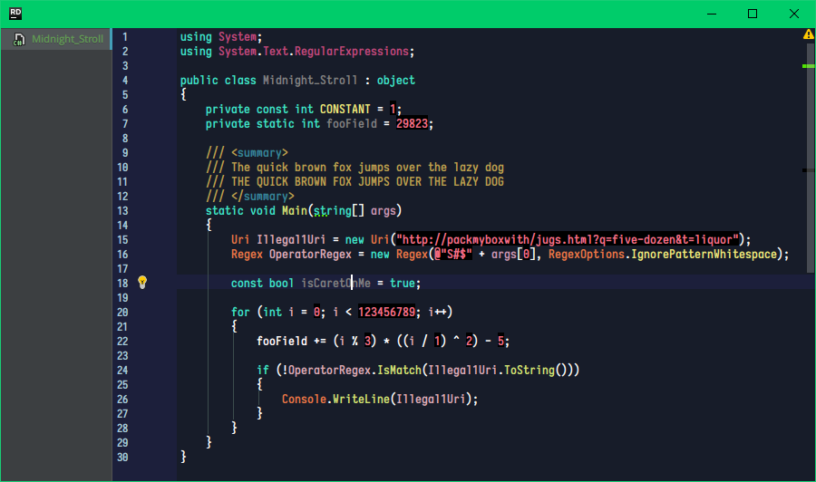

# Preface

## Introduction

Jetbrains Rider uses [Resharper](https://www.jetbrains.com/resharper/) behind the scene which supplies much more granular syntax highlighting rules. However, a side effect of this is that most color schemes that can be found online which are touted as being compatible with all of Jetbrain' IDEs will look broken and/or plain bad in Rider as they were not made to fit the new rules.

The color schemes in this repository were all made and tweaked manually to both look attractive and provide greater functional insights to your brain.

# Included...

## Sunbathe

A relaxing light color scheme for day-time usage, inspired by Solarized light. It's so smooth it could make you cry.

---

## Midnight Stroll

A dark color scheme that is dark and depressing, but has a touch of spunk so that it doesn't make you wanna to go bed. A color scheme of choice to use when trying to fix bugs in PulseAudio at 3 in the morning and your eyes are bloodshot and you want to cry.

---

## Acid Rain

According to the established laws of physics, visible green light oscillating at around 555nm stimulates cones on the retina more easily than other wavelenghts. With that in mind, I see no reason why code drawn on a green backdrop wouldn't stimulate your mind more vividly, much like green light stimulates cones.