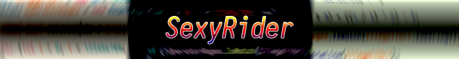
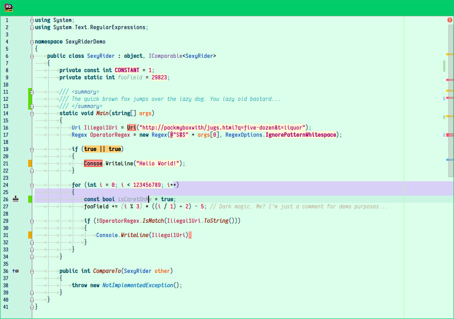
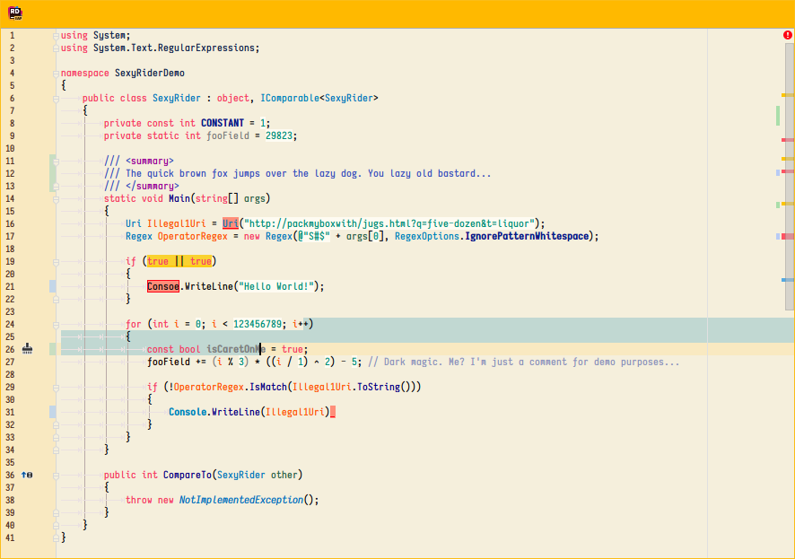
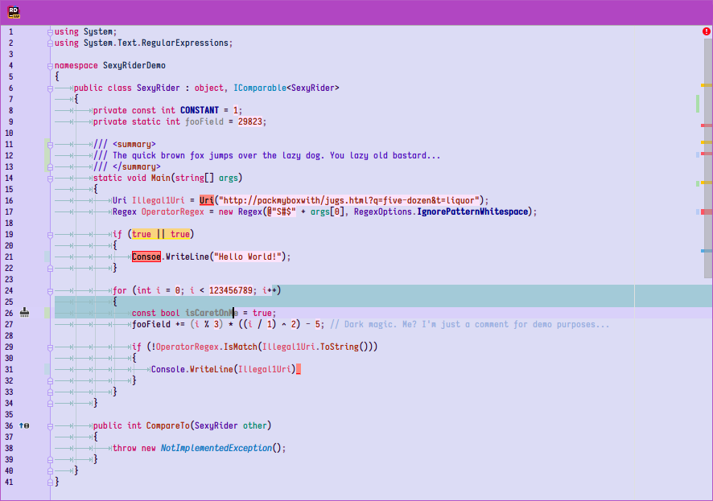
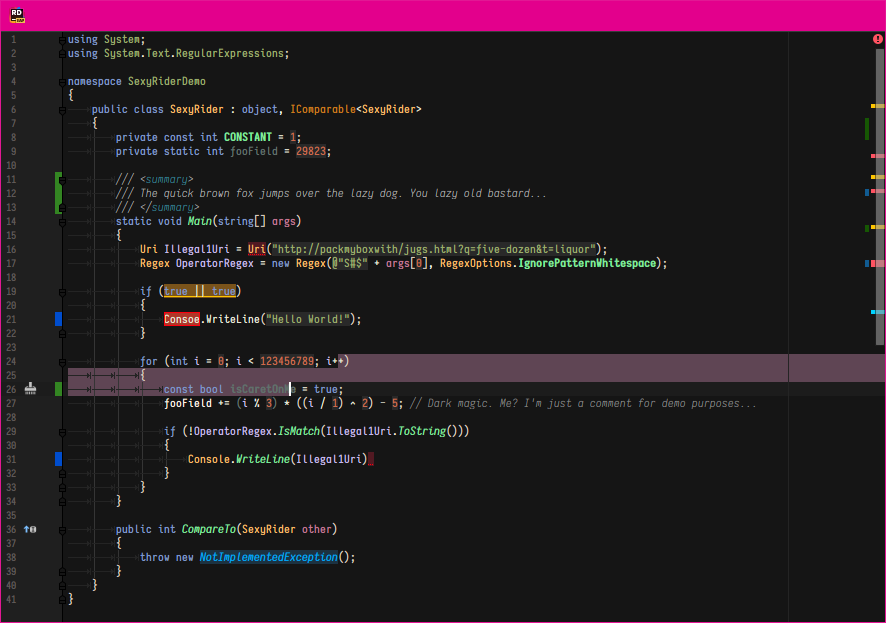
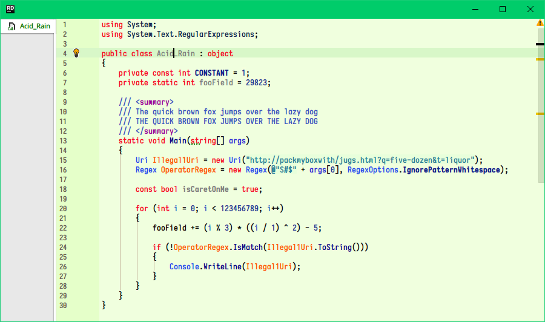

# Preface

## Introduction

Jetbrains Rider uses [Resharper](https://www.jetbrains.com/resharper/) behind the scene which has a more granular mechanism for syntax highlighting rules. However, a side effect of this is that most color schemes that can be found online which are touted as being compatible with all of Jetbrains' IDEs will look broken and/or plain bad in Rider as they are not designed with these rules in mind.

Frustrated with the lack of good color schemes available to Rider, I decided to start my own line which I dub "Sexy Rider", or how to bring sexy back into IDEs. Move out of the way Atom, Code, and Sublime Text hipsters, the sexiest editor is here.

## Error/Warning design philosophy
A feature common to all of the color schemes here is a *solid red* background for errors, and a solid yellow background for warnings. (instead of the typical bacon wave underneath) This makes errors **very** easy to spot at a glance and I believe this to be a much better way to highlight errors, and makes it way harder for an error to go unnoticed before moving to compilation.

Furthermore, there is a second level of distinction for errors: Code which is syntactically valid but has non-existing symbols will appear with a solid red border, whereas ordinary syntax errors will appear plain or with a bold line underneath. I believe this provides greater insight.

# Installation instructions

1. Close Rider.

2. Copy the `icls` file of your choice (read: all of them) to your Rider's color directory which is inside the preferences directory. The directory can usually be found at...

   * **Mac OS X**: `~/Library/Preferences/.RiderXX/colors/`
   * **Linux**: `~/.RiderXX/config/colors/`
   * **Windows**: `%USERPROFILE%\.RiderCXX\config\colors\`

   Where XX is the Rider version. You might have a few directories if you've jumped between different versions, e.g. EAP and Official. Try them all or figure out which one is the right one for the Rider you're using..

3. In rider, navigate to `Preferences > Editor > Colors & Fonts` and select one of the color schemes from the dropdown. Each color scheme is prefixed with `sx_` so as to clump them together.

# Color Schemes Included

## Notes on images

* Errors, warnings and other modifications were introduced in an attempt to display as much of the color palette in one image. There is a part of the code highlighted as well to show the highlighting color, and the caret line background color can also be seen along with the caret.
* The font used in all of the screenshots is my own custom build of [Iosevka](https://github.com/be5invis/Iosevka). After jumping between several different fonts throughout the years, I think Iosevka is finally the font I will stick with for a very very, _very_ long time.
* The font rendering is extra smooth despite running on Windows 10. This is thanks to the quintessencial [Mactype](https://github.com/snowie2000/mactype).

## Lush Greens

If Bob Ross had been a programmer, this is the color scheme he would have used. Sky blues, colors of forestry, the woods and the sun in harmony; A perfect projection of nature into a technological landscape... Wow, deep.

---

## Sunbathe

A relaxing light color scheme for day-time usage, inspired by Solarized light. It's so smooth it could make you cry.

---

## Wild Berries

Raspberries, blackberries, strawberries... F*** that, those are mainstream berries. Cool kids like their daily berry intake in the form of a beautiful SexyRider color scheme!

---

## Jollybeans

Originally started as a clone of [JellyBeans for Vim](https://github.com/nanotech/jellybeans.vim) (a classic!) but became more personalized over time and due to Rider's more granular syntax highlighthing engine and JellyBeans not being designed for C#, meaning I had to take some liberties.

---

## Acid Rain

According to established laws of physics, visible green light oscillating at around 555nm stimulates cones on the retina more easily than other wavelengths. With that in mind, I see no reason why code drawn on top of a vivid green back wouldn't stimulate the mind more vividly, much like green light stimulates cones.

# In the future...

- New color schemes. Currently in the works:
    * Magma Cone (A dark red theme inspired by the level of the same name in Spyro 2)
    * Ruby Tail (Inspired by my parrot's _very_ sexy red tail)

- Tweaks and fine-tuning to existing color schemes.
