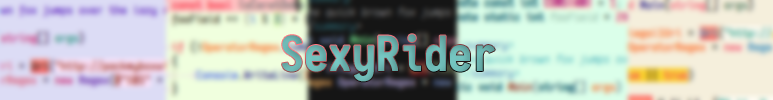
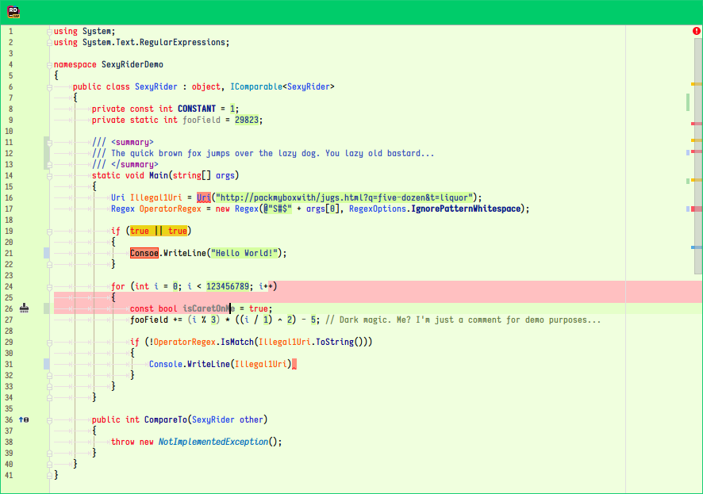

# Preface

## Introduction

Jetbrains Rider uses [Resharper](https://www.jetbrains.com/resharper/) behind the scene which supplies much more granular syntax highlighting rules. However, a side effect of this is that most color schemes that can be found online which are touted as being compatible with all of Jetbrain' IDEs will look broken and/or plain bad in Rider as they were not made to fit the new rules.

The color schemes in this repository were all made and tweaked manually to both look attractive and provide greater functional insights to your brain.

## Installation

1. Close Rider.

2. Copy the `icls` file of your choice (read: all of them) to your Rider's color directory which is inside the preferences directory. The directory can usually be found at...

   * **Mac OS X**: `~/Library/Preferences/.RiderXX/colors/`
   * **Linux**: `~/.RiderXX/config/colors/`
   * **Windows**: `%USERPROFILE%\.RiderCXX\config\colors\`

   Where XX is the Rider version. You might have a few directories if you've jumped between different versions, e.g. EAP and Official. Try them all or figure out which one is the right one for the Rider you're using.

3. Start Rider.

4. Go to `Preferences > Editor > Colors & Fonts` and select one of the color schemes. The color schemes offered here are all prefixed with `sx_` so they should be all grouped together.

# Included...

## Notes

* A feature common to ALL of the color schemes is a *solid red* background to errors. This makes them **very** easy to spot at a glance.
* The font used in all of the screenshots is a custom blend of [Iosevka](https://github.com/be5invis/Iosevka).
* The font rendering is extra saucy despite Windows 10, thanks to the quintessencial [Mactype](https://github.com/snowie2000/mactype).

## Sunbathe

A relaxing light color scheme for day-time usage, inspired by Solarized light. It's so smooth it could make you cry.

---

## Midnight Stroll

A dark color scheme that is dark and depressing, but has a touch of spunk so that it doesn't make you wanna to go bed. A color scheme of choice to use when trying to fix bugs in PulseAudio at 3 in the morning and your eyes are bloodshot and you want to cry.

---

## Acid Rain

According to the established laws of physics, visible green light oscillating at around 555nm stimulates cones on the retina more easily than other wavelenghts. With that in mind, I see no reason why code drawn on a green backdrop wouldn't stimulate your mind more vividly, much like green light stimulates cones.

# In the future...

- Brand new color schemes.
- Updates and tweaks to existing color schemes.